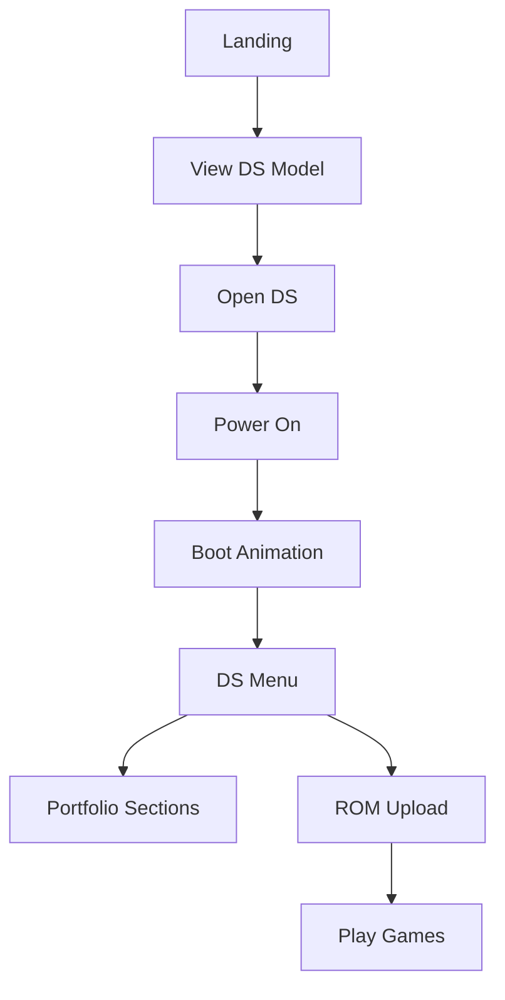

# Nintendo DS Lite Portfolio - Product Context

## Purpose & Vision

This project reimagines the traditional web portfolio by creating an interactive 3D experience centered around the iconic Nintendo DS Lite. The goal is to present a developer's portfolio in a unique, engaging way that demonstrates technical expertise while providing a nostalgic and intuitive interface.

## Core Problems Solved

1. **Portfolio Differentiation**
   - Stands out from standard web portfolios
   - Demonstrates advanced technical capabilities
   - Shows creativity in UI/UX design

2. **Technical Showcase**
   - Highlights expertise in 3D web development
   - Demonstrates complex integration capabilities (3D, UI, emulation)
   - Shows mastery of modern web technologies

3. **User Engagement**
   - Creates an interactive, memorable experience
   - Leverages nostalgia for the Nintendo DS platform
   - Makes portfolio exploration fun and engaging

## User Experience Goals

### 1. Authenticity

- Model and animations should perfectly match real DS Lite behavior
- UI elements should faithfully recreate the DS interface
- Interactions should feel natural and responsive

### 2. Intuitiveness

- Users should immediately understand how to interact
- Navigation should be clear and purposeful
- Portfolio sections should be easily accessible

### 3. Performance

- Smooth animations and transitions
- Quick loading times
- Responsive across different devices

### 4. Accessibility

- Clear instructions and tooltips
- Keyboard navigation support
- Dark mode support

## Target Audience

1. **Primary**
   - Potential employers
   - Technical recruiters
   - Fellow developers

2. **Secondary**
   - Nintendo enthusiasts
   - 3D web development community
   - Portfolio inspiration seekers

## Success Metrics

1. **Technical Performance**
   - Consistent 60fps on desktop
   - Initial load time under 3 seconds
   - Smooth animations and transitions

2. **User Engagement**
   - Time spent exploring portfolio
   - Interaction with different sections
   - ROM upload and emulation usage

3. **Accessibility**
   - WCAG compliance
   - Keyboard navigation support
   - Cross-browser compatibility

## Design Philosophy

1. **Authenticity First**
   - Every detail should match the real DS Lite
   - Animations should feel physically accurate
   - UI should be true to the original DS interface

2. **Progressive Enhancement**
   - Core portfolio content accessible without 3D
   - Graceful fallbacks for unsupported browsers
   - Mobile-friendly alternative views

3. **Performance Conscious**
   - Optimized 3D assets
   - Efficient state management
   - Smart loading strategies

## Feature Priorities

### Must Have

- Accurate 3D DS Lite model
- Opening/closing animations
- Power on/off functionality
- Basic portfolio navigation
- Responsive design

### Should Have

- ROM upload and emulation
- Save state functionality
- Touch controls for emulator
- Dark mode support

### Nice to Have

- Keyboard controls for emulation
- Drag-and-drop ROM upload
- Network play capabilities
- Extended emulator features

## User Flow

## Content Strategy

### Portfolio Sections

1. **Social Links**
   - Professional networks
   - GitHub profile
   - Contact information

2. **Projects**
   - Featured work
   - Technical achievements
   - Open source contributions

3. **About**
   - Professional background
   - Skills and expertise
   - Personal interests

4. **Blog**
   - Technical articles
   - Development insights
   - Project updates

5. **Resume**
   - Professional experience
   - Education
   - Skills and certifications

## Future Considerations

1. **Content Expansion**
   - Additional portfolio sections
   - Blog integration
   - Project case studies

2. **Feature Enhancement**
   - Extended emulator capabilities
   - Additional DS models
   - Multiplayer functionality

3. **Community Integration**
   - ROM library sharing
   - User profiles
   - Social features

This product context guides the development of a unique portfolio experience that combines technical excellence with engaging user interaction, all while maintaining the authentic feel of the Nintendo DS Lite platform.
