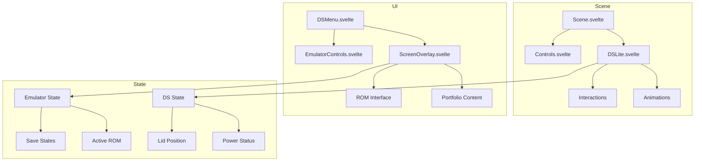

# Nintendo DS Lite Portfolio - System Patterns

## Architecture Overview

### Component Structure



## Core Design Patterns

### 1. Model-View Pattern

- Scene.svelte acts as the view container
- State management handles model layer
- Components react to state changes

### 2. State Management

```typescript
// Using Svelte 5 runes for reactive state
let dsState = $state({
    isOpen: false,
    isPowered: false,
    screenContent: null
});

// Derived state example
let canPowerOn = $derived(dsState.isOpen && !dsState.isPowered);
```

### 3. Event Delegation

```typescript
// Central event handling for 3D interactions
function handleModelInteraction(event: ModelEvent) {
    switch (event.type) {
        case 'lid':
            handleLidInteraction(event);
            break;
        case 'power':
            handlePowerInteraction(event);
            break;
    }
}
```

### 4. Screen Position Tracking

```typescript
// Track 3D screen positions for HTML overlay
function updateScreenPosition(modelMatrix: Matrix4) {
    const screenCoords = project3DTo2D(modelMatrix);
    return {
        top: screenCoords.top,
        left: screenCoords.left,
        width: screenCoords.width,
        height: screenCoords.height
    };
}
```

## Key Technical Patterns

### 1. Asset Loading Strategy

```typescript
// Progressive asset loading
async function loadAssets() {
    // Critical assets first
    await Promise.all([
        loadModel(),
        loadCriticalTextures()
    ]);
    
    // Non-critical assets after
    loadAdditionalTextures();
    loadEmulator();
}
```

### 2. Animation System

```typescript
// Animation state machine
const animationStates = {
    CLOSED: 'closed',
    OPENING: 'opening',
    OPEN: 'open',
    CLOSING: 'closing'
};

// Animation controller
class LidAnimationController {
    currentState: string;
    progress: number;
    
    transition(to: string) {
        // Handle state transitions
    }
    
    update(delta: number) {
        // Update animation progress
    }
}
```

### 3. Interaction Handling

```typescript
// Raycast-based interaction system
function handleRaycastHit(intersection: Intersection) {
    if (isInteractiveElement(intersection.object)) {
        highlightElement(intersection.object);
        enableInteraction(intersection.object);
    }
}
```

### 4. Emulator Integration

```typescript
// Emulator adapter pattern
class DeSmuMEAdapter {
    private emulator: DeSmuME;
    
    async initialize() {
        // Setup emulator
    }
    
    loadROM(data: ArrayBuffer) {
        // Handle ROM loading
    }
    
    updateScreen(topScreen: HTMLCanvasElement, bottomScreen: HTMLCanvasElement) {
        // Update screen displays
    }
}
```

## Performance Patterns

### 1. Resource Management

```typescript
// Resource pooling for reusable objects
class ResourcePool<T> {
    private pool: T[] = [];
    
    acquire(): T {
        return this.pool.pop() || this.createNew();
    }
    
    release(resource: T) {
        this.pool.push(resource);
    }
}
```

### 2. Render Optimization

```typescript
// Level of detail management
class LODController {
    updateLOD(distance: number) {
        const level = calculateLODLevel(distance);
        updateModelDetail(level);
    }
}
```

### 3. State Updates

```typescript
// Batched state updates
class StateQueue {
    private queue: StateUpdate[] = [];
    
    enqueue(update: StateUpdate) {
        this.queue.push(update);
    }
    
    processQueue() {
        // Process all updates in one batch
    }
}
```

## Error Handling Patterns

### 1. Error Boundaries

```typescript
// Component error boundary
function handleComponentError(error: Error, component: string) {
    logError(error);
    showFallbackUI(component);
}
```

### 2. Async Error Handling

```typescript
// Async operation wrapper
async function safeAsync<T>(operation: () => Promise<T>): Promise<T> {
    try {
        return await operation();
    } catch (error) {
        handleAsyncError(error);
        throw error;
    }
}
```

## Testing Patterns

### 1. Component Testing

```typescript
// Component test structure
describe('DSLite.svelte', () => {
    it('handles lid interaction', () => {
        const { component } = render(DSLite);
        const lid = component.querySelector('.lid');
        fireEvent.click(lid);
        expect(component.isOpen).toBe(true);
    });
});
```

### 2. Integration Testing

```typescript
// Integration test example
describe('Emulator Integration', () => {
    it('loads and runs ROM', async () => {
        const adapter = new DeSmuMEAdapter();
        await adapter.initialize();
        const result = await adapter.loadROM(testROM);
        expect(result.status).toBe('running');
    });
});
```

## File Organization Pattern

```sh
src/
├── lib/
│   ├── components/
│   │   ├── 3d/
│   │   │   ├── DSLite.svelte
│   │   │   ├── Scene.svelte
│   │   │   └── Controls.svelte
│   │   ├── ui/
│   │   │   ├── DSMenu.svelte
│   │   │   ├── DSScreen.svelte
│   │   │   └── EmulatorControls.svelte
│   │   └── common/
│   ├── stores/
│   │   ├── dsState.ts
│   │   └── emulatorState.ts
│   ├── utils/
│   │   ├── animation.ts
│   │   ├── emulator.ts
│   │   └── modelLoader.ts
│   └── types/
│       ├── ds.ts
│       └── emulator.ts
└── routes/
    ├── +page.svelte
    └── +layout.svelte
```

## Communication Patterns

### 1. Component Communication

```typescript
// Event dispatcher pattern
const dispatch = createEventDispatcher<{
    lidOpen: void;
    powerOn: void;
    romLoaded: { rom: ROM };
}>();
```

### 2. Store Updates

```typescript
// Centralized store updates
function updateDSState(update: Partial<DSState>) {
    dsState.update(state => ({
        ...state,
        ...update
    }));
}
```

These patterns form the foundation of the Nintendo DS Lite Portfolio application, ensuring maintainable, performant, and reliable code structure.
